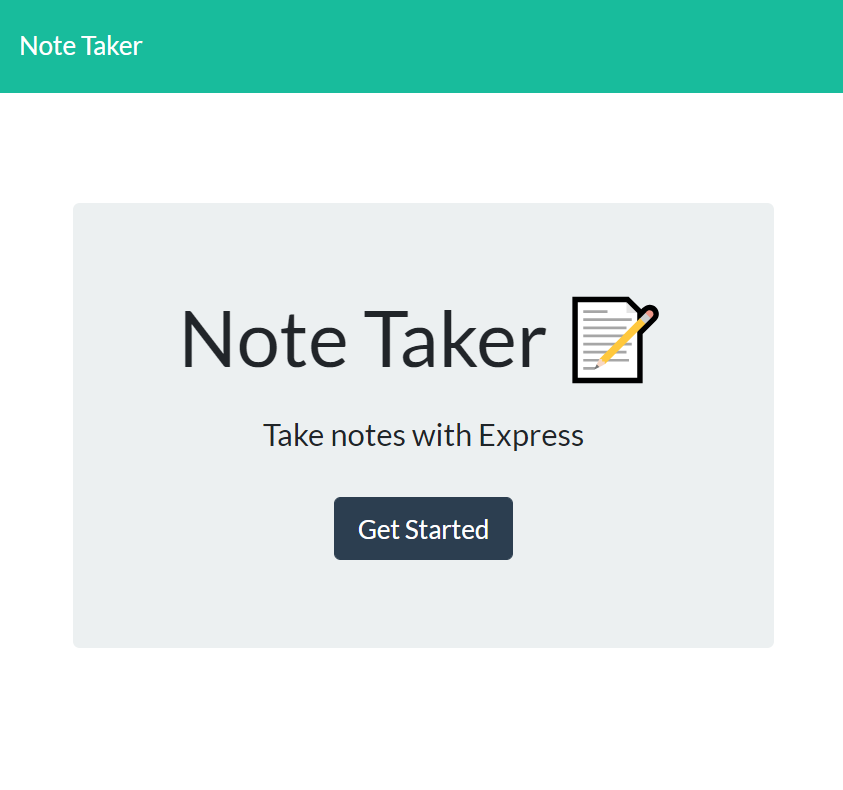

# Note-Taker



<br>

---

## Link

Heroku hosted app

https://frozen-ravine-39341.herokuapp.com/


<br>

---

## Description

An note taking application that can be used to write, save, and delete notes. This application uses an express backend and saves and retrieves note data from a JSON file.

<br>

---

## Table of Contents

[Description](#description)

[Installation](#installation)

[Usage](#usage)

[Credits](#credits)

<br>

---

## Installation

1. Clone repository 

    git clone https://github.com/Pete-Scale/note-taker.git

2. RIGHT CLICK open your terminal in the application file folder.
    
    `./note-taker`

3. Install the node modules for the inquirer package.
    ```
    npm install
    ```

<br>

---

## Usage

1. Start the local server in your terminal
    ```
    npm start
    ```
    or

    ```
    node server.js
    ```
2. Open http://localhost:3000 in your browser

<br>

---

## Credits

Special thanks to Josh and the gang for their help! Especially Vito! Thanks for the help with the readFile issue!

https://expressjs.com/en/starter/static-files.html

https://www.openmymind.net/NodeJS-Module-Exports-And-Organizing-Express-Routes/